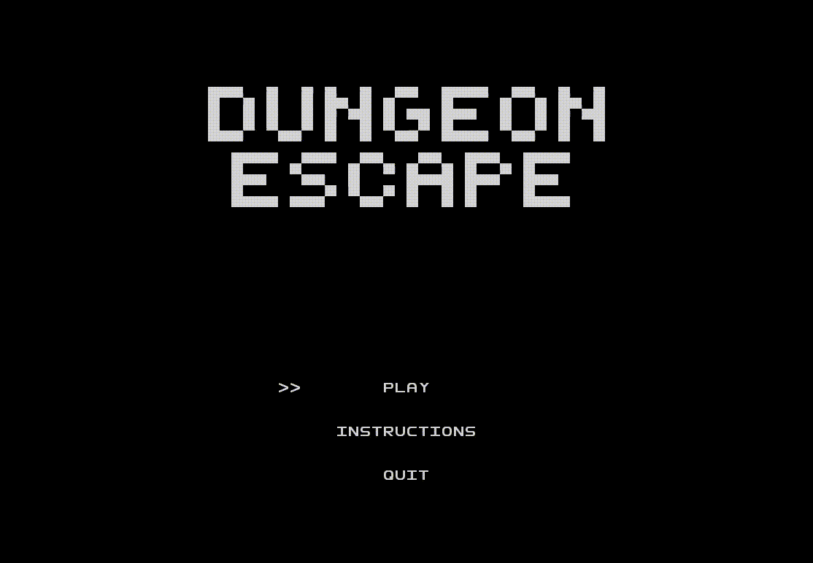

# LPOO_T3_G38

# Dungeon Escape

Gif preview of the gameplay 

You wake up imprisoned in a dungeon with endless mazes, you must get through all mazes to escape. Each maze contains one key that must be acquired to unlock an exit. After passing through all mazes you are free from  the DUNGEON.

This project was developed by André Mamprin Mori (up201700493@fe.up.pt), Daniel Gazola Bradaschia (up201700494@fe.up.pt) and Muriel Pinho (up201700132@fe.up.pt) for LPOO 2019⁄20.

## Implemented Features

* **Moving** - Player can move to all 4 directions using the arrowkeys.
* **Time Counter** - Keeps track of the time the player spent on the maze, uses a separate thread so it updates only once every second.
* **Maze Changes** - Mazes changes as the player progresses, steadily increasing the difficulty.
* **Wall Detection**  - Check if player positions conflicts with a wall, if it does player doesn't move.
* **Key** - First objective of the maze, disappears after being acquired.
* **Exit** - Checks if the player has finished the maze, only appears on the map after the player has acquired the key.    
* **Close application** - The user may press 'ESC' to close the app.
* **Menu System** - Contains a set of options and information for the player, uses menu selector and press to continue instead of text input to control the game.
* **Menu Selector** - Draws a selector on the menu so the player can choose which options it wants.
* **Give Up** - Player can give up on a maze anytime, by pressing the 'Q' key, counts as an immediate defeat and brings the user back to the main menu.

## Design

### Design Patterns

#### The interface does not match the com.g38.controller we intend to use
* **The Problem in Context** - we want to use an existing class, and the interface does not match the one we need. For example, the  com.g38.controller has different options for the menu and the maze.  
* **The Pattern** - We have applied the Adapter pattern as it let's classes work together that couldn't otherwise because of incompatible interfaces.
* **Implementation**

* **Consequences** - Its implementation allowed us to use an existing class in multiple circunstances, presenting us with a reusable class that works with unforseen classes.

#### Certain elements must possess a single instance
* **The Problem in Context** - during gameplay, we must ensure that exactly one instance of certain classes, namely the player com.g38.controller and the maze class, are instantiated at a time. The game itself must be instantiated only once.
* **The Pattern** - We have applied the Singleton pattern as it ensures that a class only has one instance and provide a global point to acess it.
* **Implementation**

* **Consequences** - Allows a global access of certain features.

#### Certain elements behave in the same manner
* **The Problem in Context** - elements of the game needed to be represented as part-whole hierarchies of objects. An element of the game may be an exit, a key, etc.
* **The Pattern** - We have applied the Composite pattern as we want to represent part-whole hierarchies of objects.
* **Implementation**

* **Consequences** - The game has been kept simple and it is easier to add new types of components.

#### The state of the game changes as requested by the player
* **The Problem in Context** - Our game must change behaviour as the player request to start or return to menu
* **The Pattern** - We have applied the State pattern as an object behavior depends on its state, and it must change that state in run-time.
* **Implementation**

* **Consequences** - The state transitions are explicit, being easier to implement them.
  
#### Operations such as undo/redo must be supported
* **The Problem in Context** - The menus must receive inputs and answer with the appropriate command.
* **The Pattern** - We have applied the Command pattern to control user input, having the gameView class draw the right interface as the command is given.
* **Implementation**

* **Consequences** - It decouples the object that invokes the operation from the one that knows how to perform it.
Commands can be extended and manipulated like any other object.

### Architectural Patterns

* **MVC** - the project is broken into 3 components. In addition to dividing the application into these components, 
         the com.g38.model–com.g38.view–com.g38.controller design defines the interactions between them.
    
  * Model: The central component of the pattern. It is the application's dynamic data structure, independent of the user interface. It directly manages the data, logic and rules of the application.

  * View: Any representation of information such as a chart, diagram or table. Multiple views of the same information are possible, such as a bar chart for management and a tabular com.g38.view for accountants.
        
  * Controller: Accepts input and converts it to commands for the com.g38.model or com.g38.view.

## Known Code Smells and Refactoring Suggestions
  

#### Data class

The Key, Wall, Exit and Player classes all contain only fields, but they do not contain any additional functionality and cannot independently operate on the data that they own.

A way to solve the problem would be to Encapsulate a collection of elements.

#### Dead Code

As the game got more complex, certain verifications and files have become obsolete, due to better options being implemented.

A way to solve this is to delete unused code and unneeded files

## Testing Results

* checkElements: Verify if all necessary elements have been created
* checkKeyExit: Verify if key and exit do not coexist
* playerPosition: Verify if the player position is valid
* keyPosition: Verify if the key position is valid
* ladderPosition: Verify if the ladder/exit position is valid

## Self-evaluation

The project was developed equally by all members, most of it was done in discord meetings in which the ideas and solutions for the code were discussed and implemented. For this reason all members had equal contribution in all parts of the project.
